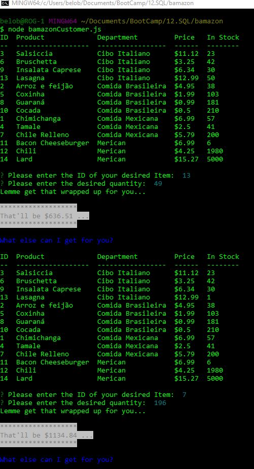
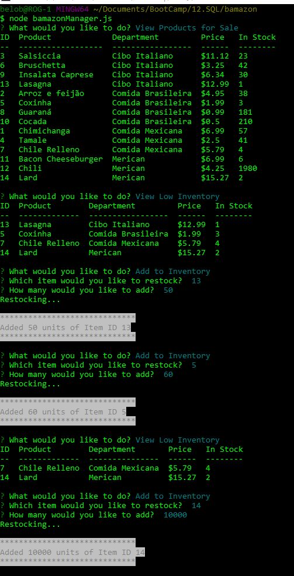

# BAMAZON
## Like Amazon, but more BAM
### ... and its run via command line ...

<!-- ## Check out the video: -->
<!-- <video width="640" controls>
  <source src="bamazon.mp4" type="video/mp4">
</video> -->
## Check out the screenshots:

### Important Features of bamazonCustomer.js
* Inventory is displayed in a tabular format
* Inventory is sorted by department name
* Total amount spent is shown in a receipt format

### Impotant Features of bamazonManager.js
* User is given an exit option, so you don't just have to use Ctrl+C to kill it
* Inventory is still displayed in tabular format
* Low inventory is also displayed in tabular format
	* If there is no low inventory, it tells you so
* Brief timeouts between returning info and prompting for next command, to allow user time to read